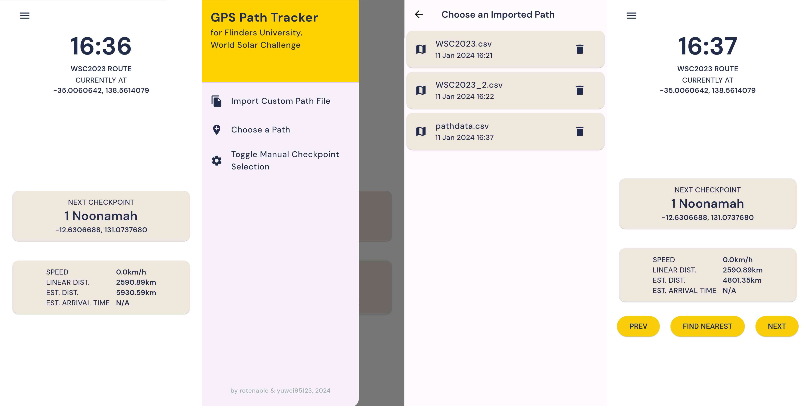

# GPS Path Tracker

This project is a Flutter-based application that tracks a user's path using GPS data. It is designed to provide real-time updates on the user's current location, speed, and estimated time of arrival to the next checkpoint. It is particularly useful for navigation and tracking purposes in various outdoor activities.

## Functionality

-    Real-Time Location Tracking: Uses GPS for current location coordinates.
-    Speed Calculation: Shows user's current speed.
-    Distance Measurement: Calculates distance to the next checkpoint.
-    ETA Calculation: Estimates arrival time at the next checkpoint.
-    Manual Checkpoint Selection: Enables choosing checkpoints manually.
-    Path Saving: Saves multiple routes for later use. (not available in the web version)

NB: The app typically updates checkpoints automatically. Manual selection is only recommended when the current checkpoint is passed by over 1 km. The "Find Nearest" feature attempts to find the two closest checkpoints, but it may not always be entirely accurate.

## CSV Format Requirements

The application by default reads from a CSV path file named "pathdata.csv" placed in the "assets" directory, each line representing a checkpoint with its name, geographical coordinates (latitude and longitude), and optionally its distance from the previous checkpoint (in metres). Users can import and use custom path files that adhere by the required formatting.

### The format of the CSV should be as follows
	##Name of Path
	#Checkpoint Name, Latitude, Longitude, Distance
	#(Distance is optional and helps calculate the estimated distance to the next checkpoint; replace with "0" if the value is not available.)
    
	Origin, lat-origin, long-origin, 0
	Checkpoint1, lat-1, long-1, dist-to-1
	Checkpoint2, lat-2, long-2, dist-to-2
	...
	Destination, lat-destination, long-destination, dist-to-destination

### Example (with distance)

	##Tonsley to Mile End
	#Checkpoint Name, Latitude, Longitude, Distance (metres)
	Tonsley (Origin), -35.00940099074852, 138.56724570681996, 0
	Mitchell Park, -35.00201687283244, 138.56664464507801, 900
	Woodlands Park, -34.9829526878604, 138.56722835848817, 2400
	Edwardstown, -34.97179781965434, 138.57111153543917, 1200
	Emerson, -34.96630121888577, 138.57368190701837, 800
	Clarence Park, -34.96092680969005, 138.58031648701203, 800
	Goodwood, -34.9510196834551, 138.58507035441235, 1300
	Adelaide Showground, -34.94358585065314, 138.58400294719934, 1000
	Mile End (Destination), -34.92478949709206, 138.58016066198672, 2000

### Example (without distance)

	##Tonsley to Mile End
	#Checkpoint Name, Latitude, Longitude, No Distance
	Tonsley (Origin), -35.00940099074852, 138.56724570681996, 0
	Mitchell Park, -35.00201687283244, 138.56664464507801, 0
	Woodlands Park, -34.9829526878604, 138.56722835848817, 0
	Edwardstown, -34.97179781965434, 138.57111153543917, 0
	Emerson, -34.96630121888577, 138.57368190701837, 0
	Clarence Park, -34.96092680969005, 138.58031648701203, 0
	Goodwood, -34.9510196834551, 138.58507035441235, 0
	Adelaide Showground, -34.94358585065314, 138.58400294719934, 0
	Mile End (Destination), -34.92478949709206, 138.58016066198672, 0

## Get the App
The app is available for download [here](https://github.com/rotenaple/GPS-Path-Tracker/releases).

## Gallery

