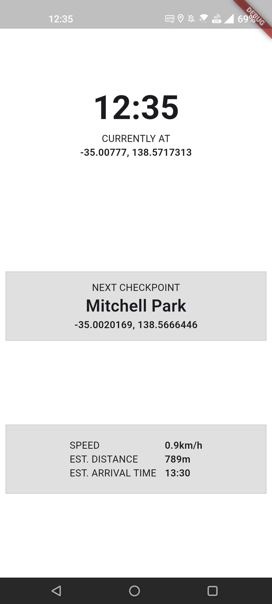

# GPS Path Tracker

This project is a Flutter-based application that tracks a user's path using GPS data. It is designed to provide real-time updates on the user's current location, speed, and estimated time of arrival to the next checkpoint. It is particularly useful for navigation and tracking purposes in various outdoor activities.

## Functionality

- Real-Time Location Tracking: Utilizes GPS to fetch and display the user's current latitude and longitude.
- Speed Calculation: Displays the current speed of the user.
- Distance Measurement: Calculates and displays the linear distance to the next checkpoint.
- Path Visualization: Users can import a predefined set of waypoints (checkpoints) through a CSV file to visualize the path they need to follow.
- ETA Calculation: Provides an estimated time of arrival to the next checkpoint based on the current speed and distance.

## CSV Format Requirements

The application requires a CSV file named 'pathdata.csv' placed in the assets directory, each line represents a checkpoint with its name and geographical coordinates (latitude and longitude).

### The format of the CSV should be as follows

    #Checkpoint Name, Latitude, Longitude
    Origin, lat-origin, long-origin
    Checkpoint1, lat-1, long-1
    Checkpoint2, lat-2, long-2
    ...
    Destination, lat-destination, long-destination

### Below is an example

	Origin (Tonsley), -35.00940099074852, 138.56724570681996
	Mitchell Park, -35.00201687283244, 138.56664464507801
	Woodlands Park, -34.9829526878604, 138.56722835848817
	Edwardstown, -34.97179781965434, 138.57111153543917
	Emerson, -34.96630121888577, 138.57368190701837
	Clarence Park, -34.96092680969005, 138.58031648701203
	Goodwood, -34.9510196834551, 138.58507035441235
	Adelaide Showground, -34.94358585065314, 138.58400294719934
	Mile End (Destination), -34.92478949709206, 138.58016066198672

## Getting Started

- Clone the Repository: Start by cloning the repository to your local machine.
- Install Dependencies: Run flutter pub get to install the necessary dependencies.
- Run the App: Use flutter run to start the application on a connected device or emulator.
- Import CSV: Make sure to place your 'pathdata.csv' file in the assets directory before running the app to visualize the path correctly.

## Gallery

